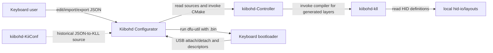
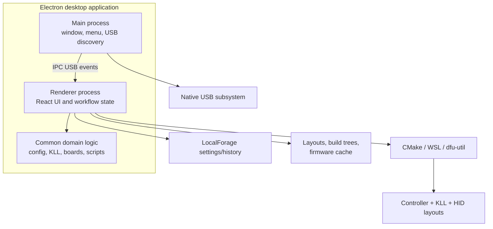
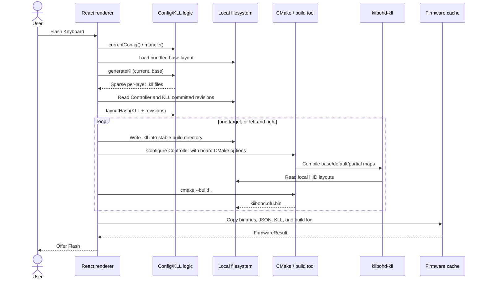

# Kiibohd Configurator architecture

This document follows the [arc42](https://arc42.org/) template. It describes
the standalone Electron configurator in this repository and, in particular,
the boundary between editing a layout, compiling firmware, and flashing a
keyboard.

## 1. Introduction and goals

Kiibohd Configurator is a desktop application for supported
Kiibohd-compatible keyboards. It lets a user:

- choose a keyboard and a bundled base layout;
- edit keys, layers, macros, animations, and custom KLL;
- import layout JSON and copy the current raw JSON to the clipboard;
- compile firmware from local source checkouts; and
- flash either newly compiled or existing firmware with `dfu-util`.

The primary architectural goal is a self-contained, offline workflow. Layouts
and firmware are not sent to a service. Compilation runs locally against
user-selected checkouts of the Controller firmware and KLL compiler.

### 1.1 Quality goals

1. **Offline safety:** editing, compilation, and flashing must not depend on
   `input.club` or another compile service.
2. **Reproducible diagnosis:** generated KLL, build logs, build trees, and WSL
   build scripts remain on disk so failed builds can be inspected.
3. **Firmware compatibility:** CMake options must mirror the supported
   `kiibohd-Controller/Keyboards/*.bash` builds.
4. **Fast iteration:** build directories are stable and reused, allowing CMake
   and the native build tool to rebuild incrementally.
5. **Cross-platform use:** the app runs on Windows, Linux, and macOS; Windows
   firmware compilation crosses into WSL.

### 1.2 Stakeholders

| Stakeholder | Concern |
| --- | --- |
| Keyboard user | Safely edit, compile, and flash a working layout |
| Firmware developer | Rebuild local Controller/KLL changes and inspect failures |
| Configurator maintainer | Keep the UI, JSON model, KLL conversion, and board definitions compatible |
| Packager | Build Electron installers with the native USB dependency |
| Sibling-repository maintainer | Understand the interfaces between Configurator, Controller, and KLL |

## 2. Architecture constraints

### 2.1 Technical constraints

- The application is based on Electron 8, React 16, TypeScript 3.8, Node
  12.14.x, and Yarn 1.
- The native `usb` module must be built for the Electron ABI.
- Firmware builds require CMake, Ninja or Make, an ARM GCC toolchain, Python 3,
  a KLL compiler, and a local `hid-io/layouts` checkout.
- `dfu-util` is an external prerequisite for flashing.
- Supported board CMake parameters are encoded in
  `src/common/device/build-targets.ts`.
- On Windows, compilation defaults to WSL because the Controller build invokes
  POSIX shell scripts and uses POSIX shell syntax.
- Default layouts are packaged from `static/layouts`; the application does not
  retrieve layouts at runtime.

### 2.2 Trust constraints

- The old Input Club domains are outside the trust boundary and must not be
  used for layouts, compilation, tools, or updates.
- The Electron renderer has Node integration enabled and web security disabled.
  It can access the filesystem, spawn processes, and use Electron `remote`.
  Consequently, the renderer and all content loaded into it are fully trusted;
  untrusted remote content must never be loaded in the application window.
- Configured executable paths, firmware source checkouts, imported layout JSON,
  custom KLL, and binaries selected for flashing are user-trusted local inputs.
- Help links may open GitHub in the system browser. The browser is outside the
  application process and is not part of editing, compilation, or flashing.

## 3. Context and scope

### 3.1 Business context

Configurator owns the interactive layout model, JSON-to-KLL conversion,
selection of board-specific CMake settings, orchestration of local processes,
build artifacts, and the flashing UI. It does not implement the firmware or
the KLL compiler.

### 3.2 Sibling repository relationships

- **Controller dependency:** [kiibohd-Controller architecture][controller-doc]
  ([local sibling document][controller-local],
  [queue task][controller-task]) describes the keyboard firmware and CMake
  integration. Configurator configures and builds this checkout at runtime.
- **KLL dependency:** [kiibohd-kll architecture][kll-doc]
  ([local sibling document][kll-local], [queue task][kll-task]) describes the
  compiler. Controller's CMake integration invokes it while Configurator's
  build is running.
- **Historical reference:** [kiibohd-KiiConf architecture][kiiconf-doc]
  ([local sibling document][kiiconf-local],
  [queue task][kiiconf-task]) describes the former web configurator.
  Configurator's JSON-to-KLL conversion was ported from KiiConf
  `download.php`, but KiiConf is not a runtime dependency.
- **This document:** [Configurator queue task][configurator-task].

[controller-doc]: https://github.com/MarkDrei/kiibohd-Controller/blob/master/docs/arc42/index.md
[controller-local]: ../../../kiibohd-Controller/docs/arc42/index.md
[controller-task]: https://github.com/users/MarkDrei/projects/1/views/1?pane=issue&itemId=245893628
[kll-doc]: https://github.com/MarkDrei/kiibohd-kll/blob/master/docs/arc42/index.md
[kll-local]: ../../../kiibohd-kll/docs/arc42/index.md
[kll-task]: https://github.com/users/MarkDrei/projects/1/views/1?pane=issue&itemId=245893567
[kiiconf-doc]: https://github.com/MarkDrei/kiibohd-KiiConf/blob/master/docs/arc42/index.md
[kiiconf-local]: ../../../kiibohd-KiiConf/docs/arc42/index.md
[kiiconf-task]: https://github.com/users/MarkDrei/projects/1/views/1?pane=issue&itemId=245893631
[configurator-task]: https://github.com/users/MarkDrei/projects/1/views/1?pane=issue&itemId=245893640

### 3.3 Technical interfaces

| Interface | Direction | Contract |
| --- | --- | --- |
| Layout JSON files | User/filesystem → renderer | KIICONF-shaped `header`, `matrix`, and optional visual/macro/custom sections |
| Raw layout JSON | Renderer → clipboard | Mangled current configuration shown in a modal and copied on request |
| USB device events | Native USB module → main → renderer | Known VID/PID attach/detach events and optional string descriptors |
| Controller checkout | Filesystem → build orchestration | Checkout root containing `CMakeLists.txt` and Controller modules |
| KLL checkout | Filesystem → CMake | Optional checkout containing `kll/kll`; otherwise an installed compiler may be used |
| HID layouts checkout | Filesystem → KLL | `KLL_LAYOUTS_PATH`; required to prevent KLL's dependency from fetching layouts |
| Build tools | Renderer → child processes | CMake configuration/build, directly or through `wsl.exe` |
| Firmware binary | Build/cache/filesystem → `dfu-util` | `kiibohd.dfu.bin`, one file or left/right files for split boards |

## 4. Solution strategy

- Keep keyboard editing in a React renderer and hardware discovery in the
  Electron main process.
- Share pure layout, KLL-generation, board, and build-script logic under
  `src/common`.
- Port KiiConf's JSON-to-KLL conversion into the app instead of calling its
  former server endpoint.
- Drive the Controller's existing CMake entry point with board-specific
  arguments equivalent to its keyboard scripts.
- Inject local KLL and HID-layout paths so compilation has no network
  requirement.
- Write generated KLL into a stable build directory before CMake runs.
- On Windows, generate a readable `build.sh` and execute it via WSL, translating
  configured Windows paths with `wslpath`.
- Cache finished firmware and provenance (layout JSON, KLL, log, and source
  revision-derived hash) under Electron's user-data directory.
- Keep flashing separate from compilation so a user can inspect the build and
  can flash an existing `.bin`.

## 5. Building block view

### 5.1 Level 1

### 5.2 Main process (`src/main`)

- `index.ts` creates the `BrowserWindow`, loads the development server or
  packaged `index.html`, installs the application menu, and owns USB-watch IPC.
- `usb.ts` wraps the native `usb` module, emits attach/detach events, and safely
  reads manufacturer, product, and serial descriptors.
- `keyboard.ts` maps USB devices to supported keyboard definitions.
- `menu.ts` provides standard desktop actions and opens optional documentation
  links in the system browser.

The main process sends `usb-currently-attached`, `usb-attach`, and
`usb-detach` messages. Other privileged work, including filesystem access,
process spawning, dialogs, compilation, and flashing, currently occurs in the
Node-enabled renderer.

### 5.3 Renderer (`src/renderer`)

- `app.tsx` loads persisted settings and mounts the application layout.
- `keyboard-select` chooses a supported board, variant, and bundled layout.
- `configure` renders and modifies keys, layers, macros, visuals, animations,
  defines, and custom KLL.
- `state` and `shared-state` hold current workflow, configuration, and settings
  state through React hooks and reducer-like updates.
- `db.ts` uses LocalForage for settings and firmware history metadata.
- `local-storage/compile.ts` orchestrates KLL generation and local firmware
  builds.
- `local-storage/firmware.ts` records completed build artifacts and normalizes
  the older downloaded-firmware result shape.
- `flash/flash.tsx` selects firmware and spawns `dfu-util`.

### 5.4 Common domain logic (`src/common`)

- `config` defines the persisted layout model, normalization, manipulation, and
  KLL generation. `normalize.ts` maps persisted firmware aliases into the UI
  model; `mangle.ts` reverses that mapping and injects edited macros into
  custom KLL before compilation or raw-JSON display.
- `config/kll.ts` converts a layout and its bundled base into sparse per-layer
  KLL files. WhiteFox keys are matched by scan code because its layouts may
  differ in matrix length.
- `device/keyboard.ts` is the catalog of supported keyboards, variants, USB
  identifiers, and reset metadata.
- `device/build-targets.ts` maps each board and variant to Controller CMake
  parameters. Infinity Ergodox expands to left and right targets.
- `device/build-script.ts` creates CMake arguments and the reproducible WSL
  script using pure, testable helpers.

### 5.5 Local data

Under Electron's user-data directory:

- LocalForage stores toolchain settings, utility paths, the last build result,
  recent results, and animation settings.
- `builds/<board>-<layout>-<hash>/<side>/` contains an incremental CMake build,
  generated KLL, and `build.sh` for WSL builds.
- `firmware-cache/<board>_<layout>_<hash>/` contains copied firmware binaries,
  source layout JSON, generated KLL, and `build.log`.
- `static/layouts` in source (packaged as `resources/static/layouts`) contains
  default and base layout snapshots.

## 6. Runtime view

### 6.1 Startup and keyboard discovery

1. Electron creates a Node-enabled renderer window.
2. The renderer loads persisted settings from LocalForage and discovers local
   `dfu-util`/driver utility paths.
3. The renderer subscribes to USB watching over IPC.
4. The main process enumerates attached known VID/PID pairs and sends the
   initial list.
5. For shared identifiers, the main process opens the USB device long enough
   to read descriptors and identify the keyboard.
6. Subsequent native USB attach/detach events are filtered and forwarded to the
   renderer.

### 6.2 Edit or import a layout

1. The user selects a keyboard, variant, and bundled layout, or imports JSON.
2. The renderer normalizes persisted aliases, IDs, coordinates, animations,
   and custom sections into its editable UI model.
3. React state tracks edits to matrix assignments, layers, macros, visuals,
   animations, defines, and custom KLL.
4. `currentConfig()` mangles the UI model back to persisted aliases and injects
   macro KLL. **View Raw JSON** displays that representation and can copy it to
   the clipboard; this version has no save-to-file export dialog.

### 6.3 Compile firmware

Important boundaries:

- **Application runtime:** JSON loading, editing, KLL text generation, process
  orchestration, logging, caching, USB observation, and invoking `dfu-util`.
- **Firmware compile time:** Controller CMake configuration invokes the local
  KLL compiler, which reads generated layer files and local HID definitions;
  C/C++ compilation and linking produce `kiibohd.dfu.bin`.
- **Keyboard runtime:** only the resulting firmware executes on the keyboard.
  Configurator, KLL, CMake, WSL, and KiiConf are absent.

The CMake configuration passes the Controller's chip, compiler, scan, macro,
output, and debug modules; base/default/partial maps; USB IDs; layout name; and
`CONFIGURATOR=1`. It supplies `KLL_EXECUTABLE` and its working directory when a
KLL checkout is configured.

The build identity is an MD5 digest of board, layout, generated KLL content,
and the committed Controller/KLL revisions. Uncommitted sibling-repository
changes intentionally reuse the same build directory and cache identity.

### 6.4 Windows/WSL build

1. Configurator writes `build.sh` in the Windows-visible build directory.
2. The script translates configured Windows paths with `wslpath`, exports
   `KLL_LAYOUTS_PATH`, optionally prepends `PATH`, and chooses Ninja before
   Make.
3. Configurator runs
   `wsl.exe [--distribution <name>] --cd <build-dir> -- bash ./build.sh`.
4. CMake and the ARM toolchain execute inside WSL while source and output may
   stay on the Windows filesystem.
5. The renderer reads the resulting binary from Windows and caches it.
6. Flashing remains a Windows-side process.

### 6.5 Flash firmware

1. The flashing panel uses the most recent compiled firmware or a user-selected
   `.bin`.
2. USB state indicates whether a known keyboard is currently in a flashable
   bootloader mode.
3. The renderer spawns `dfu-util -D <binary>`.
4. Standard output and error stream into the progress view.
5. Exit status determines success, missing executable, missing DFU device, or a
   generic failure.
6. Infinity Ergodox left and right binaries are confirmed and flashed
   separately.

Compilation and flashing are deliberately separate operations: successful
compilation does not write a keyboard until the user chooses **Flash**.

## 7. Deployment view

### 7.1 Packaged desktop

Electron Builder produces Windows NSIS/ZIP, Linux AppImage/TAR, and macOS
DMG/ZIP artifacts. The package contains:

- the Electron main and renderer bundles;
- static images, fonts, and layout JSON;
- the native `usb` addon; and
- application metadata and icons.

The firmware compiler, Controller sources, KLL sources, HID definitions, CMake,
build tool, ARM toolchain, and `dfu-util` are not application-owned services.
They are local prerequisites configured by the user.

### 7.2 Platform topology

- **Windows:** Electron and `dfu-util` run on Windows; compilation normally
  runs in a selected/default WSL distribution.
- **Linux/macOS:** Electron spawns CMake and the selected native build tool
  directly.
- **Keyboard:** connected over USB, first as an application device and then as
  a DFU bootloader device for flashing.

## 8. Cross-cutting concepts

### 8.1 Offline operation

Runtime layout retrieval, remote compilation, update checks, and tool downloads
are disabled. `KLL_LAYOUTS_PATH` is mandatory because the compiler's layouts
dependency may otherwise contact GitHub. Optional documentation links are the
only intentional browser-facing network path.

### 8.2 Configuration and persistence

Toolchain paths and WSL options are user settings persisted with LocalForage.
Large build artifacts live as ordinary files, while recent-result metadata
points to those files.

### 8.3 Errors and observability

Compile subprocess stdout/stderr is streamed into the build dialog and retained
as `build.log`. Missing configuration and expected tool failures are converted
to `CompileError` messages. The generated WSL script is retained for manual
reproduction. Flash output is streamed separately in the flashing panel.

### 8.4 Naming and identity

Generated file names use sanitized `header.Name` and `header.Layout`. The
layout hash separates builds when generated KLL or committed source revisions
change. Board and variant definitions select product IDs and base maps.

### 8.5 Split boards

Infinity Ergodox is one editing model but two firmware targets. Compilation
uses side-specific base maps and product IDs, caching both binaries in one
logical result. Flashing remains two explicit physical operations.

### 8.6 Security

The process model is not a browser sandbox. With Node integration,
`electron.remote`, process spawning, and `webSecurity: false`, any renderer
code has the user's local privileges. The central control is therefore to load
only packaged/local application content and to keep external pages in the
system browser. Imported layouts and custom KLL should be treated as code-like
inputs because they influence generated firmware and the compiler.

## 9. Architecture decisions

### 9.1 Local compilation instead of a compile service

**Decision:** generate KLL and build firmware on the user's machine.

**Rationale:** the original service is gone and old Input Club domains are
untrusted. Local compilation protects layout privacy and supports firmware
development.

**Consequences:** setup is more complex and users must maintain source
checkouts and a cross-compilation toolchain.

### 9.2 Bundled layout snapshot

**Decision:** ship a vetted KiiConf layout snapshot and its base layouts.

**Rationale:** keyboard selection and KLL differencing work offline and do not
depend on a mutable remote source.

**Consequences:** adding or correcting a layout requires an application
release and clear provenance in `static/layouts/SOURCE.md`.

### 9.3 Reuse Controller CMake

**Decision:** encode board settings in Configurator but invoke the Controller
repository's existing CMake build.

**Rationale:** avoid duplicating the firmware build system while matching the
known keyboard scripts.

**Consequences:** changes to Controller board scripts can drift from
`build-targets.ts` and require coordinated maintenance.

### 9.4 WSL script boundary on Windows

**Decision:** generate and execute a shell script through WSL.

**Rationale:** Controller build helpers require POSIX semantics, and a file
avoids quoting corruption through Windows and `wsl.exe`.

**Consequences:** WSL is an additional deployment prerequisite, but the exact
build command is reproducible.

### 9.5 Renderer-owned privileged workflows

**Decision:** retain filesystem, child-process, dialog, and flashing logic in
the renderer.

**Rationale:** this matches the existing Electron 8 implementation and keeps
workflow code close to the UI.

**Consequences:** there is no meaningful renderer sandbox. Loading remote or
otherwise untrusted active content would be unsafe.

## 10. Quality requirements

### 10.1 Scenarios

| Quality | Scenario | Expected response |
| --- | --- | --- |
| Offline operation | Network is unavailable during editing and compilation | Bundled layouts and configured local dependencies allow the workflow to finish |
| Safety | User presses **Flash Keyboard** | The app compiles first and requires a separate Flash action before device mutation |
| Diagnosability | CMake, KLL, or the compiler fails | Live output is visible and the log/build script remain on disk |
| Performance | User changes one firmware source file and rebuilds | The stable CMake build directory enables an incremental rebuild |
| Compatibility | User selects a split Infinity Ergodox | Two side-specific binaries are built and offered separately |
| Portability | Windows build uses paths on a Windows drive | The generated script translates paths and runs tools inside WSL |
| Privacy | User imports a private layout | The app reads and processes it locally without a compile-server request |

### 10.2 Automated verification

The test suite covers KLL naming, base-key differencing, raw/consumer/system key
forms, sparse layers, WhiteFox scan-code matching, animations, layout hashing,
CMake argument generation, WSL path handling, and board target expansion.
TypeScript validation and ESLint provide static checks.

## 11. Risks and technical debt

- Electron 8, Node 12, React 16, TypeScript 3.8, and several dependencies are
  obsolete and no longer receive normal security support.
- The renderer is privileged and unsandboxed; `webSecurity: false` magnifies
  the impact of accidentally loading untrusted content.
- USB watch listeners are indexed by renderer ID but are not visibly removed
  when a renderer is destroyed.
- Board build parameters duplicate values from Controller shell scripts and
  can drift.
- The source-revision reader handles ordinary `.git` directories but not every
  Git worktree or submodule `.git` file shape; failure collapses the revision
  component to an empty string.
- Cache identity excludes uncommitted Controller/KLL changes and installed
  tool versions, so it is optimized for iterative builds rather than complete
  provenance.
- MD5 is adequate as a cache key but should not be interpreted as an integrity
  or authenticity guarantee.
- Imported layout validation and custom KLL isolation are limited; malformed or
  hostile local inputs can fail compilation or produce unsafe firmware.
- `dfu-util` is spawned directly by the renderer, and flashing integrity relies
  on the selected local executable and binary.
- Legacy remote-compile ZIP ingestion helpers remain in
  `local-storage/firmware.ts` without callers, increasing ambiguity around a
  network path that the standalone product no longer supports.
- CI checks pure build helpers but does not exercise the end-to-end
  JSON-to-firmware or USB flashing workflow with real sibling checkouts.
- Documentation menu links still target the upstream repository rather than
  this fork.

## 12. Glossary

| Term | Meaning |
| --- | --- |
| Controller | `kiibohd-Controller`, the firmware source and CMake build system |
| DFU | Device Firmware Upgrade protocol used by the keyboard bootloader |
| KiiConf | Historical web configurator; source of the layout format and conversion logic |
| KLL | Keyboard Layout Language and the compiler that generates firmware data |
| Base layout | Bundled stock layout used to express only changed key mappings |
| Default map | Layer 0 map supplied to Controller's KLL CMake integration |
| Partial map | Additional generated KLL layer supplied after the default map |
| HID layouts | Local `hid-io/layouts` definitions consumed by the KLL dependency |
| WSL | Windows Subsystem for Linux, used as the POSIX firmware-build environment |
| Firmware cache | Durable copies of completed binaries and their layout/KLL/log provenance |
